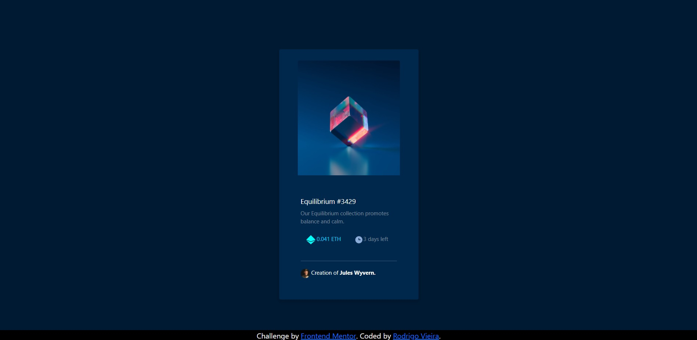

# Frontend Mentor - NFT preview card component solution

This is a solution to the [NFT preview card component challenge on Frontend Mentor](https://www.frontendmentor.io/challenges/nft-preview-card-component-SbdUL_w0U). Frontend Mentor challenges help you improve your coding skills by building realistic projects. 

## Overview

### The challenge

Users should be able to:

- View the optimal layout depending on their device's screen size
- See hover states for interactive elements

### Screenshot

### Built with

- HTML5
- CSS
- Bootstrap

**Note: Delete this note and the content within this section and replace with your own learnings.**

### Continued development

I want to continue my learning in the Frontend area, it is an area which I am very interested.

### Useful resources

- [Bootstrap Cards](https://getbootstrap.com/docs/4.0/components/card/) - This helped me for learning how to deal with cards and bootstrap.
- [Bootstrap Grids](https://getbootstrap.com/docs/4.0/layout/grid/) - This is an amazing article shows the fundemantals of bootstrap grids.
- [W3Schools color picker](https://www.w3schools.com/colors/colors_picker.asp) - This helped me to choose the right color for my projects.
